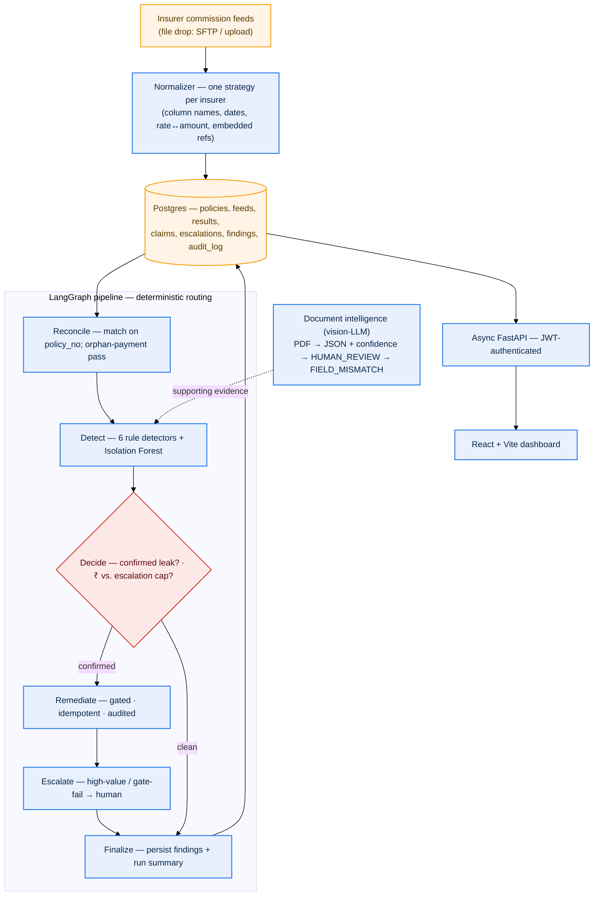

# LeakSentinel

**Production-grade commission reconciliation & revenue-leakage detection for insurance distribution — explainable, governed, and auditable**

[](https://python.org)
[](LICENSE)
[](tests/)


---

## What It Does

A distributor sells insurance policies and roadside-assistance subscriptions through OEM dealers on behalf of several insurers, and earns commission on each policy. The money owed back is easy to lose: every insurer reports what it paid in its own statement format, those statements rarely line up cleanly with the policies on our books, and the gap between *what we should have been paid* and *what we were paid* is where revenue silently leaks.

LeakSentinel normalizes every insurer feed into one canonical shape, reconciles it against the expected commission, detects each leak with an explainable reason a human can re-derive and dispute, and then takes **governed** remediation action — gated, idempotent, and written to a hash-chained audit log. A vision-LLM is used *only* to read documents; **every decision about money is deterministic code**.

## Architecture



| Stage | Role |
|---|---|
| **Normalizer** | One `Normalizer` strategy per insurer (column names, dates, rate↔amount, embedded refs). Adding an insurer is one class. |
| **Reconcile** | Matches normalized feeds against expected commission on `policy_no`; second pass flags orphan payments. |
| **Detect** | 6 explainable rule detectors (primary) + Isolation Forest (secondary novelty net that never overrides a rule). |
| **Decide** | Tags each finding `remediate` / `escalate` / `informational` with the *same* predicate the action gate uses — no LLM in the routing path. |
| **Remediate** | Claims a shortfall back from the insurer — gated, idempotent, audited. |
| **Escalate** | Routes high-value or gate-failing findings to a human queue with full context. |
| **Finalize** | Materialises findings + run summary into Postgres for the read API. |

## Design Principles

- **The LLM never decides whether to move money.** It reads documents — rasterised PDFs in, structured JSON with per-field confidence out — and nothing else. Every financial judgement (is this a leak? how much? claim, escalate, or refuse?) is made by deterministic, auditable rules and gates.
- **Deterministic routing.** The LangGraph `Decide` node tags each finding with the *same* predicate the action gate applies, so re-runs are reproducible and there is no LLM in the routing path.
- **Governed action: gated, idempotent, audited.** Remediation passes a single gate (`validate_action`); writes are idempotent at the database layer (a partial unique index on the active claim per `policy_no`+`reason_code`, with an INSERT-first/savepoint flow so a concurrent retry never double-pays); and every action *and* every refusal appends to the audit log.
- **Hash-chained audit log.** Each `audit_log` row stores `sha256(prev_hash + canonical_json(payload))` plus a gap-free `sequence_no`, so deleting or reordering any row breaks the chain from that point on. Integrity is verifiable (`verify_audit_chain`) — append-only and tamper-evident, not merely "immutable by convention".

## Stack

| Layer | Technology |
|---|---|
| Orchestration | LangGraph 1.2, typed `ReconciliationState` |
| Reconciliation | SQLAlchemy 2.0 over PostgreSQL; deterministic expected-vs-actual engine |
| Detection | 6 explainable rule detectors + scikit-learn Isolation Forest (secondary) |
| Document intelligence | Vision LLM (Anthropic Claude / Groq via LangChain) — PDF → JSON + confidence |
| LLM | Anthropic (default) — swappable via `LLM_PROVIDER` env var (Groq supported) |
| Tracing | LangSmith — optional, every node is a named span |
| API | FastAPI 0.136, async, WebSocket-free polling for async jobs, structured errors |
| Auth | JWT (python-jose) + bcrypt, RBAC (admin/ops/viewer), 8-hour sessions |
| Database | PostgreSQL, SQLAlchemy 2.0 `mapped_column`, Alembic migrations |
| Frontend | React + Vite + TypeScript, typed `fetch` client mirroring Pydantic models |
| Cloud | Docker, docker-compose (Postgres · backend · seed worker · frontend) |
| Testing | pytest (incl. async httpx), integration-gated precision/recall suite |

## Key Features

- ✅ Deterministic LangGraph pipeline — 7 nodes, typed `ReconciliationState`, conditional routing, **no LLM in the money-decision path**
- ✅ Per-insurer normalizer registry — adding an insurer is a single `Normalizer` class
- ✅ 6 explainable rule detectors (missing, underpaid, duplicate, 1+1-renewal, rounding, orphan payment) sharing one canonical reason-code vocabulary
- ✅ Secondary Isolation Forest — reports only *novel* outliers the rules didn't cover; never overrides a rule
- ✅ Governed remediation — single gate, DB-level idempotency (partial unique index + savepoint), every action and refusal audited
- ✅ Hash-chained, gap-checked audit log — tamper-evident (`verify_audit_chain`)
- ✅ Opposite-sign exposure — underpayment (owed to us) and clawback (we owe back) reported separately, never summed into one figure
- ✅ Money as fixed-2dp **strings** in JSON — never a float
- ✅ Async reconcile jobs — `POST /reconcile` enqueues, poll `GET /reconcile/{job_id}`; serialized (concurrent call → 409)
- ✅ Feed upload (CSV + PDF) — pdfplumber table extraction with vision-LLM fallback; uploads overlay the synthetic baseline at reconcile time
- ✅ Document intelligence — vision-LLM PDF extraction with per-field confidence → `HUMAN_REVIEW` / `FIELD_MISMATCH`
- ✅ JWT auth + RBAC (admin/ops/viewer), self-service signup, admin user management, forced password change
- ✅ Optional LangSmith tracing — every node is a named span
- ✅ Exact precision/recall vs a synthetic ground-truth oracle, enforced in CI behind an `integration` marker

## Quickstart

**Prerequisites:** Python 3.11+ (the Makefile targets 3.13), Docker (for Postgres), Node 18+ (for the frontend)

```bash
git clone https://github.com/Subh24ai/LeakSentinel.git
cd LeakSentinel
cp .env.example .env          # dev defaults work out of the box
```

**Full stack with Docker (recommended):**
```bash
docker compose up -d --build
# Frontend → http://localhost:5173   API → http://localhost:8000 (Swagger /docs)
```
This starts Postgres (host port 5433), the backend (runs `alembic upgrade head`), a one-shot worker that seeds synthetic data, and the frontend. Sign in with the bootstrap admin from `.env` (`admin@leaksentinel.local` / `changeme-admin` — you'll set a new password on first login), or register a new account from the login page.

**Local dev without Docker for the backend (hot reload):**
```bash
make install                  # editable install into a venv (override: make install PYTHON=python3.11)
docker compose up -d postgres # Postgres on host port 5433
make migrate                  # alembic upgrade head
make gen-data && make ingest  # generate + normalize the synthetic feeds
make run                      # FastAPI on http://localhost:8000

# Frontend (second terminal)
cd frontend && npm install && npm run dev   # http://localhost:5173
```

**Run your first reconciliation (via the API):**
```bash
# Step 1 — get a JWT (OAuth2 password flow):
TOKEN=$(curl -s -X POST http://localhost:8000/auth/token \
  -d "username=admin@leaksentinel.local&password=changeme-admin" | jq -r .access_token)

# Step 2 — enqueue a reconciliation run (returns a job_id):
JOB=$(curl -s -X POST http://localhost:8000/reconcile \
  -H "Authorization: Bearer $TOKEN" | jq -r .job_id)

# Step 3 — poll for the summary:
curl -s http://localhost:8000/reconcile/$JOB -H "Authorization: Bearer $TOKEN" | jq .
```

**Run the whole pipeline from the CLI (prints a confusion matrix):**
```bash
make pipeline     # Intake → Reconcile → Detect → Decide → Remediate/Escalate → Finalize
make reconcile    # engine only — planted (oracle) vs. detected, per class
```

**Run tests:**
```bash
make test         # 99 tests (DB-backed; needs Postgres up + seeded)
```

## Project Structure

```
LeakSentinel/
├── src/leaksentinel/
│   ├── ingestion/          # per-insurer normalizers, feed loader, upload processor
│   │   ├── normalizer.py   # Normalizer registry — one strategy per insurer
│   │   ├── loader.py       # synthetic / uploaded / combined feed loading
│   │   └── upload_processor.py # CSV + PDF (pdfplumber → vision-LLM fallback)
│   ├── reconciliation/     # ORM models, expected-vs-actual engine, canonical schemas
│   │   ├── models.py       # 14 tables: policies, feeds, results, findings, audit_log …
│   │   └── engine.py       # match on policy_no + orphan-payment pass + confusion summary
│   ├── detection/          # explainable detectors
│   │   ├── rules.py        # 6 rule detectors + the canonical DetectionReason vocab
│   │   └── anomaly.py      # Isolation Forest novelty net (secondary, never overrides)
│   ├── actions/            # the "act" half — gated, idempotent, audited
│   │   ├── remediation.py  # claim/rebill + hash-chained audit + idempotency
│   │   ├── escalation.py   # human-queue routing
│   │   └── externalapi.py  # MOCKED insurer/CRM API (swappable seam)
│   ├── graph/              # LangGraph workflow, typed state, run entry, tracing
│   ├── documents/          # vision-LLM PDF extraction + validation against policies
│   ├── auth/               # JWT, users, RBAC, bootstrap admin
│   ├── api/                # FastAPI app, service layer, Pydantic schemas
│   ├── config.py · db.py · llm.py
├── frontend/               # React + Vite + TypeScript dashboard
├── scripts/                # synthetic data, document generation, init_db, extraction
├── alembic/                # migrations (schema authority; matches the ORM models)
├── tests/                  # pytest suite — engine, detection, actions, API, documents
├── data/synthetic/         # generated insurer feeds + ground_truth.json oracle
├── docker-compose.yml      # postgres · backend · seed worker · frontend
└── Makefile
```

## API Reference

All data endpoints require a JWT bearer token (`Authorization: Bearer <token>`). Obtain one from `POST /auth/token` (OAuth2 password flow) or by registering at `POST /auth/signup`. Three roles: `admin`, `ops`, `viewer`. Money is always a fixed-2dp **string** in JSON, never a float. Swagger UI is at `/docs`.

| Method | Endpoint | Auth | Description |
|---|---|---|---|
| `GET` | `/health`, `/` | — | Liveness / service metadata |
| `POST` | `/auth/signup` | — | Self-service registration — returns a JWT (first user → admin, rest → viewer) |
| `POST` | `/auth/token` | — | Obtain an 8-hour JWT (OAuth2 password flow) |
| `GET` | `/auth/me` | JWT | Current authenticated principal |
| `POST` | `/auth/register` | `admin` | Create a user with a temporary password |
| `GET`·`PATCH`·`DELETE` | `/auth/users`, `/auth/users/{id}` | `admin` | User management (list, role/active, soft-delete) |
| `POST`·`GET` | `/reconcile`, `/reconcile/jobs` | `admin`,`ops` | Enqueue a run (202) / list jobs; concurrent run → 409 |
| `GET` | `/reconcile/{job_id}` | `admin`,`ops`,`viewer` | Poll job status + summary |
| `GET`·`POST` | `/feeds`, `/feeds/upload`, `/feeds/{id}` | `admin`,`ops` | Upload + list insurer feed files (CSV/PDF) |
| `GET` | `/leaks`, `/leaks/{policy_no}` | `admin`,`ops`,`viewer` | Enriched, filterable leak list + per-policy detail |
| `GET` | `/claims`, `/escalations`, `/audit`, `/metrics` | `admin`,`ops`,`viewer` | Claims, human queue, audit log, dashboard aggregates |

## Financial Model

Exposure is reported as **two figures of opposite sign** — never summed into one "at risk" number:

- **Underpayment exposure** — commission owed **to us**: missing commission, underpayment below the contracted rate, unprovisioned 1+1 renewals, orphan payments, and ML-flagged anomalies.
- **Clawback liability** — money we **received but owe back**: duplicate payments.

`total_claimed` is the sum of claims *lodged* with the insurer — not confirmed-recovered money — and the dashboard labels it "Claimed (pending confirmation)" accordingly.

## Benchmarks

| Metric | Value |
|---|---|
| Reconciliation accuracy vs ground-truth oracle | **Exact** — 0 false positives / 0 false negatives across 200 policies |
| Planted-scenario recall (missing · underpaid · duplicate) | 7/7 each, exact |
| End-to-end pipeline (200 policies) | Completes in **< 1s** — fully deterministic, no LLM in the path |
| Test suite | **99 passing, 0 skipped, 0 failing** |
| Schema integrity | `alembic check` clean — ORM models match migration head |
| LLM usage | Document extraction only — **never** in a money decision |

> Reproduce locally: `make reconcile` prints the planted-vs-detected confusion matrix; `make pipeline` runs the full graph and prints the end-to-end summary with a conservation check.

## Known Limitations

- **Synthetic data only** — everything is generated by `scripts/generate_synthetic_data.py`, including the ground-truth oracle the tests assert against. The insurer/OEM names (ICICI Lombard, Bajaj, Digit, Tata AIG; Hero, Honda, TVS, Ather) are real brands used purely for realism; no real statements or distributor systems are involved.
- **External claims/CRM API is mocked** — `actions/externalapi.py` is a deliberate, clearly-labelled stub behind a stable interface, swappable for a real ITSM/insurer client.
- **Document intelligence is a standalone path** — the vision-LLM extractor is real and tested (LLM mocked offline), reachable via `scripts/run_extraction.py` and as the PDF-upload fallback, but it is **not yet a node in the reconciliation graph** nor exposed via its own API endpoint.
- **Single active LLM provider** — Anthropic (default) or Groq, selected by `LLM_PROVIDER`; no automatic fallback. The core pipeline and full test suite run with **no LLM key** required.
- **Self-service signup is open** — anyone who can reach the app can register (viewer by default). For a real deployment, gate behind email-domain allowlisting or admin approval.

## Roadmap

- ✅ **Core engine** — deterministic expected-vs-actual reconciliation + orphan-payment pass; 6 explainable detectors + Isolation Forest; synthetic data + ground-truth oracle (exact confusion matrix)
- ✅ **Governed actions** — gated/idempotent/audited remediation, hash-chained audit log, materialised findings store, Alembic migrations
- ✅ **Full-stack** — React auth flow + full-stack Docker compose (Postgres · backend · seed worker · frontend)
- ✅ **User management** — admin CRUD, roles, forced password change, roles UI
- ✅ **Feed ingestion** — CSV/PDF upload API + UI, async reconcile jobs
- ✅ **In progress** — uploaded feeds overlaid into reconciliation (`source=all`), self-service signup
- ⬜ **Next** — wire document intelligence into the graph (emit `FIELD_MISMATCH` findings), real insurer-API connector, multi-provider LLM fallback

## License

[MIT](LICENSE).

---

Built by [Subhash Gupta](https://linkedin.com/in/subhash24gupta) · [GitHub](https://github.com/Subh24ai/LeakSentinel)
