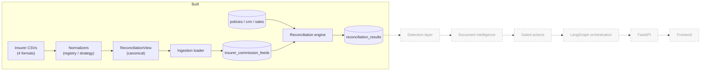

# LeakSentinel

Commission-reconciliation engine for two-wheeler insurance distribution.

> ⚠️ **Synthetic data only.** Everything in this repo runs on programmatically
> generated data. The insurer names (ICICI Lombard, Bajaj, Digit, Tata AIG) and
> OEM names (Hero, Honda, TVS, Bajaj, Ather) are real brands used purely to make
> the scenario realistic. **No real insurer commission statements, and no
> SureDrive internal systems or data, are involved.** See `scripts/generate_synthetic_data.py`.

## Problem

A distributor sells roadside-assistance (RSA) subscriptions and insurance
policies through OEM dealers, on behalf of several insurers, and earns
commission on each policy. The money owed back is easy to lose track of:
each insurer reports what it actually paid in its own statement format, those
statements rarely line up cleanly with the policies on our books, and the
gap between *what we should have been paid* and *what we were paid* is where
revenue silently leaks. Reconciliation is hard precisely because the "actual"
side is heterogeneous — different column names, date encodings (DD/MM/YYYY vs
epoch seconds vs …), commission expressed sometimes as an absolute amount and
sometimes as a rate to apply, and policy references that are sometimes exact
and sometimes buried inside a longer string — so before anything can be matched
on `policy_no`, every feed has to be normalized into one canonical shape.

## Current status

Built through the reconciliation engine. The detection layer and everything
downstream are **not built yet** and are clearly marked below.

### Done

- **Schema** (`reconciliation/models.py`) — `dealers`, `sales` (with the 1+1
  renewal flags), `policies` (`policy_no` UNIQUE), `insurer_commission_feeds`,
  `crm_records`, `reconciliation_results`, `audit_log`. Single one-directional
  `policies.sale_id → sales.id` link. Create/reset via `db.py` + `scripts/init_db.py`.
- **Canonical schema** (`reconciliation/schemas.py`) — `ReconciliationView`
  plus `ReconStatus` / `ReasonCode` / `ResolutionState` / `PaymentStatus` enums.
- **Synthetic data generator** (`scripts/generate_synthetic_data.py`) — 200
  policies across 4 insurers, four deliberately different feed formats, ~17.5%
  injected leakage, and a **ground-truth oracle** (`data/synthetic/ground_truth.json`)
  recording which `policy_no` got which scenario.
- **Normalization layer** (`ingestion/normalizer.py`) — registry/strategy
  pattern: one `Normalizer` subclass per insurer, registered by name; adding a
  5th insurer is one class, no dispatcher edits.
- **Ingestion loader** (`ingestion/loader.py`, `make ingest`) — runs each
  normalizer and persists into `insurer_commission_feeds`; flagged/unparseable
  rows are persisted *with* their `normalization_notes` (nothing dropped).
- **Reconciliation engine** (`reconciliation/engine.py`, `make reconcile`) —
  joins feeds ↔ `policies` ↔ `crm_records` on `policy_no` and classifies each
  policy as `MATCHED` / `MISSING_COMMISSION` / `UNDERPAID` / `OVERPAID_DUPLICATE`
  / `CRM_MISMATCH`, persisting results with a status and preliminary reason code.
  The core leak query is kept in **both** raw SQL and SQLAlchemy form.
- **Precision/recall tests** — the engine's output is asserted to match the
  oracle exactly (any invented or missed leak fails the build). 42 tests total.

### Planned (NOT built)

- **Detection layer** — renewal-not-provisioned (1+1) detection from the sale
  flags, rounding-delta scoring, ML anomaly scoring beyond the deterministic rules.
- **Document intelligence** — parse real statement files; generate dispute docs.
- **Gated actions** — notify / dispute / escalate, with approval gates.
- **LangGraph orchestration** — tie detection + documents + actions into an agent.
- **API** — FastAPI surface (only a health/metadata stub exists today).
- **Frontend** — none.

## Pipeline (as built)



Solid = built. Dashed/grey = planned, not implemented.

## The core problem, in one table

Each insurer's commission feed is in a different format. Normalizing all four
into one `ReconciliationView` is the precondition for any matching:

| Insurer | Sample columns | Date format | Commission | Policy ref |
| --- | --- | --- | --- | --- |
| ICICI Lombard | `Policy Reference`, `Premium Collected`, `Commission Payable`, `Payment Date`, `Settlement Status` | `DD/MM/YYYY` | absolute amount | exact (`IL-TW-100021`) |
| Bajaj | `policy_ref`, `gross_premium`, `commission_rate_pct`, `settled_on`, `txn_status` | `YYYY-MM-DD` | **rate %** → × premium | embedded (`BAJAJ/2025/BJ-TW-100118/DL`) |
| Digit | `ReferenceID`, `PremiumAmount`, `CommissionAmt`, `PaidEpoch`, `Status` | epoch seconds | absolute amount | embedded (`DIGIT-DG-TW-100075-TW`) |
| Tata AIG | `PolicyNumber`, `Premium`, `BrokeragePercent`, `DateOfPayment`, `PaymentStatus` | `DD-Mon-YYYY` | **rate %** → × premium | exact (`TA-TW-100136`) |

Free-text statuses (`SETTLED` / `paid` / `SUCCESS` / `Completed` / …) are also
normalized to a single `PaymentStatus` enum.

## Tech stack

Python 3.11+, SQLAlchemy 2 + psycopg (Postgres), pydantic v2, pandas,
scikit-learn, pytest. FastAPI is scaffolded; LangGraph is a declared dependency
but not yet used.

## Run what exists

```bash
# 0. Install (editable, with dev extras) into a Python 3.11+ venv
make install

# 1. Start Postgres (host port 5433 — 5432 is often already taken)
docker compose up -d postgres

# 2. Create the schema
make db-recreate

# 3. Generate synthetic data + load dealers/sales/policies/crm into Postgres,
#    write the 4 insurer CSVs and ground_truth.json
#    (NOTE: this also resets the schema, so it's safe to run on its own)
make gen-data

# 4. Normalize the 4 insurer CSVs into insurer_commission_feeds
make ingest

# 5. Reconcile and print the confusion summary
make reconcile

# 6. Run the test suite (includes the precision/recall backbone)
make test
```

`make reconcile` prints planted (oracle) vs. detected (engine) per class:

```
=== Confusion summary: planted (oracle) vs. detected (engine) ===
Class                  Planted  Detected    TP    FP    FN
----------------------------------------------------------
MATCHED                    179       179   179     0     0
MISSING_COMMISSION           7         7     7     0     0
UNDERPAID                    7         7     7     0     0
OVERPAID_DUPLICATE           7         7     7     0     0
CRM_MISMATCH                 0         0     0     0     0
----------------------------------------------------------
TOTAL                      200       200

EXACT MATCH — zero false positives/negatives.
```

`ROUNDING_DELTA` and `RENEWAL_1PLUS1_NOT_PROVISIONED` policies are planted in
the data but read as `MATCHED` here on purpose — they are not commission-amount
mismatches on a single feed line, and belong to the (planned) detection layer.

## Make targets

`make help` lists everything (install, db-up/down/reset, db-init/recreate,
gen-data, ingest, reconcile, run, test, lint, clean).
