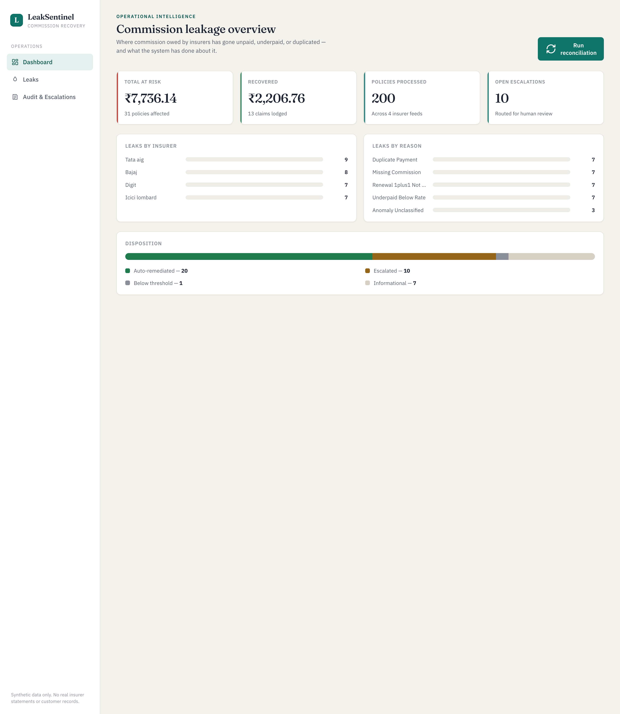
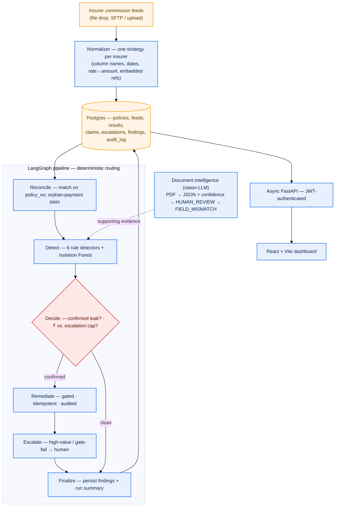

# LeakSentinel

Commission reconciliation and revenue-leakage detection for insurance distribution.



## What it does

A distributor sells insurance policies and roadside-assistance subscriptions
through OEM dealers on behalf of several insurers, and earns commission on each
policy. The money owed back is easy to lose: every insurer reports what it paid
in its own statement format, those statements rarely line up cleanly with the
policies on our books, and the gap between *what we should have been paid* and
*what we were paid* is where revenue silently leaks. LeakSentinel normalizes
every insurer feed into one canonical shape, reconciles it against the expected
commission, detects each leak with an explainable reason a human can re-derive
and dispute, and then takes **governed** remediation action — gated, idempotent,
and written to a hash-chained audit log. A vision-LLM is used *only* to read
documents; every decision about money is deterministic code.

## Architecture



Feeds arrive as files and are parsed by a registry of per-insurer `Normalizer`
strategies (adding an insurer is one class). The reconciliation engine and the
six explainable detectors run inside a single LangGraph pipeline with
**deterministic** routing — the LLM is never in the decision path. Each run
materialises its findings into a `findings` table, so the read API and dashboard
serve from that table rather than re-running the model on every request.

## Design principles

- **The LLM never decides whether to move money.** It reads documents —
  rasterised PDFs in, structured JSON with per-field confidence out — and nothing
  else. Every financial judgement (is this a leak? how much? claim, escalate, or
  refuse?) is made by deterministic, auditable rules and gates.
- **Deterministic routing.** The LangGraph `Decide` node tags each finding with
  the *same* predicate the action gate applies, so re-runs are reproducible and
  there is no LLM in the routing path.
- **Governed action: gated, idempotent, audited.** Remediation passes a single
  gate (`validate_action`); writes are idempotent at the database layer (a
  partial unique index on the active claim per `policy_no`+`reason_code`, with an
  INSERT-first/savepoint flow so a concurrent retry never double-pays or
  double-calls the insurer); and every action *and* every refusal appends to the
  audit log.
- **Hash-chained audit log.** Each `audit_log` row stores
  `sha256(prev_hash + canonical_json(payload))` plus a gap-free `sequence_no`, so
  deleting or reordering any row breaks the chain from that point on. Integrity is
  verifiable (`verify_audit_chain`); it is append-only and tamper-evident, not
  merely "immutable by convention".

## API

All data endpoints require a JWT bearer token (`Authorization: Bearer <token>`).
Obtain one from `POST /auth/token` (OAuth2 password flow). Three roles:
`admin`, `ops`, `viewer`.

| Endpoint | Method | Auth |
| --- | --- | --- |
| `/health`, `/` | GET | public (liveness) |
| `/auth/token` | POST | public (returns a JWT) |
| `/auth/me` | GET | any valid token |
| `/reconcile` | POST | `admin`, `ops` |
| `/leaks`, `/leaks/{policy_no}` | GET | `admin`, `ops`, `viewer` |
| `/claims`, `/escalations`, `/audit`, `/metrics` | GET | `admin`, `ops`, `viewer` |

`POST /reconcile` is serialized — a concurrent call while a run is in flight gets
`409`. Swagger UI is at `/docs`. Money is always a fixed-2dp **string** in JSON,
never a float.

## Running locally (development)

Prerequisites: Python 3.11+, Docker (for Postgres), Node 18+ (for the frontend).

```bash
# 0. Install (editable, with dev extras) into a Python 3.11+ venv
make install

# 1. Start Postgres (host port 5433)
docker compose up -d postgres

# 2. Build the schema with migrations
make migrate                  # alembic upgrade head

# 3. Generate synthetic data + seed master tables, then normalize the feeds
make gen-data                 # writes the 4 insurer CSVs + ground_truth.json
make ingest

# 4. Configure auth + run the API (set JWT_SECRET first — see below)
cp .env.example .env          # then fill in JWT_SECRET and FIRST_ADMIN_PASSWORD
make run                      # FastAPI on http://localhost:8000, Swagger at /docs

# 5. Frontend (second terminal)
cd frontend && npm install && npm run dev   # http://localhost:5173
```

Local development uses **synthetic data only** — everything is generated by
`scripts/generate_synthetic_data.py`, including a ground-truth oracle the tests
assert against. The insurer/OEM names (ICICI Lombard, Bajaj, Digit, Tata AIG;
Hero, Honda, TVS, Ather) are real brands used purely to make the scenario
realistic; no real statements or distributor systems are involved.

Other targets: `make help`, `make test`, `make lint`, `make reconcile`,
`make pipeline`, `make gen-docs`, `make extract-doc`.

## Running in production

1. **Set required configuration** (no insecure defaults exist):
   - `JWT_SECRET` — the API refuses to start without it. Generate with
     `python -c "import secrets; print(secrets.token_urlsafe(48))"`.
   - `DATABASE_URL` — the production Postgres DSN.
   - `FIRST_ADMIN_EMAIL` / `FIRST_ADMIN_PASSWORD` — bootstrap the first admin on
     first start (skipped if no password is set).
   - Insurer feed transport credentials (SFTP / object-store) for the ingestion
     drop point.
2. **Migrate the schema:** `alembic upgrade head`. Production never uses
   `create_all`; the direct path in `scripts/init_db.py` is gated behind `--dev`.
3. **Start the API** (e.g. `uvicorn leaksentinel.api.main:app` behind a process
   manager / container). The startup hook fails closed if `JWT_SECRET` is unset.

## CI

`.github/workflows/ci.yml` runs on every push and PR to `main`: it stands up a
Postgres 15 service, installs the package, lints with ruff, applies
`alembic upgrade head`, seeds synthetic data, and runs the test suite split into
two pytest invocations — `-m integration` (which **fails the build if zero
integration tests are collected**, so the precision/recall and end-to-end
guarantees can never silently skip) and `-m "not integration"` for the unit
tests.

## Financial model

Exposure is reported as **two figures of opposite sign** — never summed into one
"at risk" number:

- **Underpayment exposure** — commission owed **to us**: missing commission,
  underpayment below the contracted rate, unprovisioned 1+1 renewals, orphan
  payments, and ML-flagged anomalies.
- **Clawback liability** — money we **received but owe back**: duplicate
  payments.

`total_claimed` is the sum of claims *lodged* with the insurer — it is not
confirmed-recovered money, and the dashboard labels it "Claimed (pending
confirmation)" accordingly.

The detection layer is six explainable rule detectors (missing, underpaid,
duplicate, 1+1-renewal-not-provisioned, rounding, and orphan/unexpected payment)
plus a secondary Isolation Forest that only reports novel outliers the rules
didn't cover and never overrides a rule. The engine and the detectors share one
canonical reason-code vocabulary (`DetectionReason`), so a reconciliation row and
the finding for the same policy always show the same `reason_code`.

## Tech stack

**Backend** — Python 3.11, FastAPI + uvicorn, SQLAlchemy 2 + psycopg (Postgres),
Alembic (migrations), Pydantic v2 + pydantic-settings, LangGraph (orchestration)
with optional LangSmith tracing, scikit-learn (Isolation Forest), a vision LLM
(Anthropic Claude / Groq via LangChain) for document extraction, python-jose +
bcrypt for auth, pytest (incl. async httpx) throughout — **86 tests**, with the
DB-backed precision/recall and end-to-end suites gated behind the `integration`
marker.

**Frontend** — React + Vite + TypeScript, a typed `fetch` client mirroring the
Pydantic models, money rendered from the fixed-2dp string (never parsed to a
float).

## License

[MIT](LICENSE).
