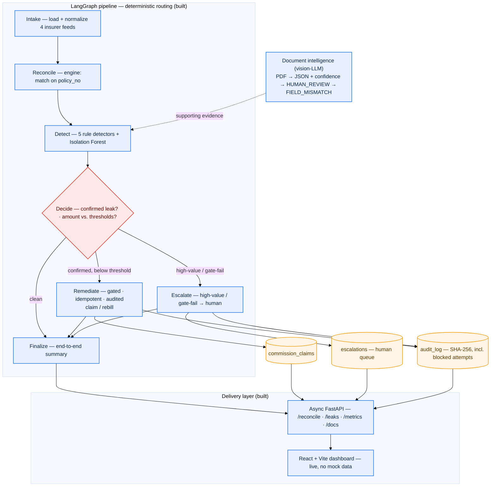
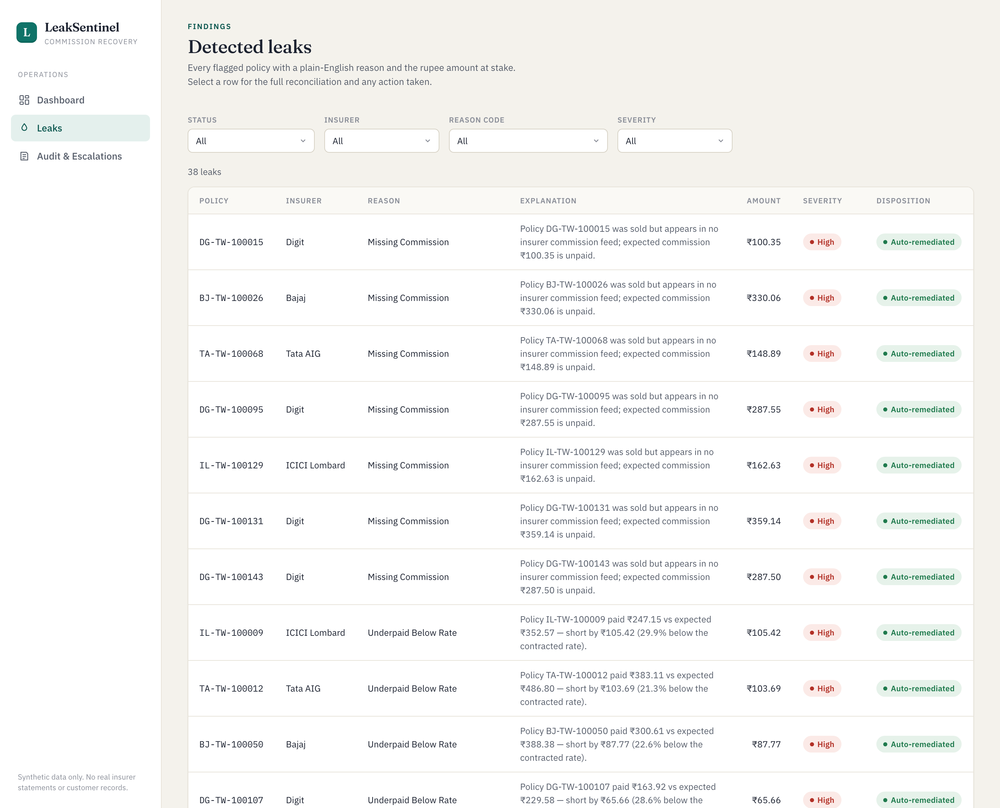

# LeakSentinel

Commission-reconciliation engine for two-wheeler insurance distribution.

> ⚠️ **Synthetic data only.** Everything in this repo runs on programmatically
> generated data. The insurer names (ICICI Lombard, Bajaj, Digit, Tata AIG) and
> OEM names (Hero, Honda, TVS, Bajaj, Ather) are real brands used purely to make
> the scenario realistic. **No real insurer commission statements, and no
> distributor's internal systems or data, are involved.** See `scripts/generate_synthetic_data.py`.


## Highlights

- **Governed AI, not a GPT wrapper** — a vision-LLM only *reads* statements;
  every decision about money is made by deterministic rules and gates.
- **Five explainable leak detectors** — missing, underpaid, duplicate,
  unprovisioned 1+1 renewals, and rounding — each with a reason a human can
  re-derive and put in a dispute, plus an Isolation Forest for novel outliers.
- **Safe by construction** — remediation is gated, idempotent (retries never
  double-pay), and written to an immutable SHA-256 audit log; high-value items
  short-circuit to a human queue.
- **Complete stack** — Postgres → LangGraph pipeline → async FastAPI → React +
  Vite dashboard, backed by **79 tests** and an oracle-checked precision/recall
  guarantee (zero invented or missed leaks).

## Problem

A distributor sells roadside-assistance (RSA) subscriptions and insurance
policies through OEM dealers, on behalf of several insurers, and earns
commission on each policy. The money owed back is easy to lose track of:
each insurer reports what it actually paid in its own statement format, those
statements rarely line up cleanly with the policies on our books, and the
gap between *what we should have been paid* and *what we were paid* is where
revenue silently leaks. Reconciliation is hard precisely because the "actual"
side is heterogeneous — different column names, date encodings (DD/MM/YYYY vs
epoch seconds vs …), commission expressed sometimes as an absolute amount and
sometimes as a rate to apply, and policy references that are sometimes exact
and sometimes buried inside a longer string — so before anything can be matched
on `policy_no`, every feed has to be normalized into one canonical shape.

## Design principles

**The LLM never decides whether to move money.** It reads documents — rasterised
PDFs in, structured JSON with per-field confidence out — and nothing else.
*Every* financial judgement (is this a leak? how much? do we claim it, escalate
it, or refuse?) is made by deterministic, auditable rules and gates, and every
money-moving side effect is idempotent and written to an immutable audit log.
The LangGraph routing is likewise deterministic, not LLM-driven. So the
"intelligence" is confined to perception; *action* is governed code you can
re-derive by hand and defend to an insurer.

That split is deliberate: it's the difference between a GPT wrapper and a system
that takes **governed** action.

## Current status

**Complete end-to-end**, all backed by tests:
**ingestion → reconciliation → detection → document intelligence →
decision → remediation / escalation**, orchestrated as a single LangGraph
pipeline, exposed over an **async FastAPI** surface and driven from a
**React + Vite + TypeScript** operational dashboard. Only optional hardening
(e.g. an AWS deployment) remains — the system runs locally today, front to back.

### Done

- **Schema** (`reconciliation/models.py`) — `dealers`, `sales` (with the 1+1
  renewal flags), `policies` (`policy_no` UNIQUE), `insurer_commission_feeds`,
  `crm_records`, `reconciliation_results`, `audit_log`. Single one-directional
  `policies.sale_id → sales.id` link. Create/reset via `db.py` + `scripts/init_db.py`.
- **Canonical schema** (`reconciliation/schemas.py`) — `ReconciliationView`
  plus `ReconStatus` / `ReasonCode` / `ResolutionState` / `PaymentStatus` enums.
- **Synthetic data generator** (`scripts/generate_synthetic_data.py`) — 200
  policies across 4 insurers, four deliberately different feed formats, ~17.5%
  injected leakage, and a **ground-truth oracle** (`data/synthetic/ground_truth.json`)
  recording which `policy_no` got which scenario.
- **Normalization layer** (`ingestion/normalizer.py`) — registry/strategy
  pattern: one `Normalizer` subclass per insurer, registered by name; adding a
  5th insurer is one class, no dispatcher edits.
- **Ingestion loader** (`ingestion/loader.py`, `make ingest`) — runs each
  normalizer and persists into `insurer_commission_feeds`; flagged/unparseable
  rows are persisted *with* their `normalization_notes` (nothing dropped).
- **Reconciliation engine** (`reconciliation/engine.py`, `make reconcile`) —
  joins feeds ↔ `policies` ↔ `crm_records` on `policy_no` and classifies each
  policy as `MATCHED` / `MISSING_COMMISSION` / `UNDERPAID` / `OVERPAID_DUPLICATE`
  / `CRM_MISMATCH`, persisting results with a status and preliminary reason code.
  The core leak query is kept in **both** raw SQL and SQLAlchemy form.
- **Precision/recall tests** — the engine's output is asserted to match the
  oracle exactly (any invented or missed leak fails the build).
- **Detection layer** (`detection/rules.py` + `detection/anomaly.py`) — **5
  explainable rule detectors** (missing commission, underpaid-below-rate,
  duplicate payment, **1+1 renewal-not-provisioned**, rounding-delta), each
  emitting a `reason_code` + `severity` + a plain-English explanation a human can
  re-derive and put in a dispute. A **secondary Isolation Forest** flags novel
  outliers the rules don't yet encode, but only reports policies the rules
  *didn't* cover and never overrides a rule — rules-first, by design, because
  finance acts on defensible reasons, not on anomaly scores. Asserted against the
  oracle in `test_detection.py`.
- **Document intelligence** (`documents/extractor.py`,
  `scripts/generate_documents.py`, `make gen-docs` / `make extract-doc`) — a
  **vision-LLM** reads a rasterised statement PDF and returns **structured JSON
  with per-field confidence**; any field below the confidence threshold routes
  the whole extraction to **`HUMAN_REVIEW`**. `validate()` then joins the
  extracted fields against the `policies` table and flags each divergence with a
  **`FIELD_MISMATCH`** reason code, naming the offending field. The LLM only
  *reads*; it takes no financial action. Tests **mock the vision call** (fully
  offline, deterministic — `test_documents.py`); the live path
  (`make extract-doc`) needs a real LLM **API key**.
- **Gated actions** (`actions/`, `scripts/run_actions.py`) — remediation on
  confirmed leaks behind three tested safety properties: **gated**
  (`validate_action` blocks unless the finding is a confirmed open leak with a
  real reason code above `MIN_CLAIM_THRESHOLD`), **idempotent** (DB-enforced:
  SHA-256 key of `policy_no|reason_code|amount` with a `UNIQUE` constraint, so a
  retry returns the existing claim and never double-pays), and **audited** (every
  action *and* every blocked attempt appends a SHA-256-hashed `audit_log` row).
  High-value findings **short-circuit straight to a human** before any action is
  attempted; gate-failing findings land on the `escalations` queue. The
  insurer/CRM call sits behind a swappable `ExternalClaimsAPI` stub. Covered by
  `test_actions.py`.
- **LangGraph orchestration** (`graph/`, `make pipeline`) — the whole thing wired
  as one graph over a typed pydantic `ReconciliationState`: **Intake → Reconcile
  → Detect → Decide → Remediate | Escalate → Finalize**. Routing is
  **deterministic** (a `Decide` node tags each finding using the *same* predicate
  the action gate applies — not an LLM), so re-runs are reproducible. **LangSmith
  tracing** turns on when `LANGSMITH_API_KEY` is set and degrades to a single log
  line when it isn't. End-to-end test (`test_pipeline.py`) asserts the run
  reconciles with the oracle — every planted MISSING_COMMISSION becomes a claim
  or an escalation, none lost.
- **API** (`api/`, `make run`) — an **async FastAPI** surface over the pipeline:
  `POST /reconcile` (runs the graph, returns the typed summary + conservation
  check), `GET /leaks` (filterable by status / insurer / reason_code / severity,
  each item enriched with the explanation + ₹ amount), `GET /leaks/{policy_no}`
  (recon + finding + actions taken), `GET /claims`, `GET /escalations`,
  `GET /audit`, and `GET /metrics` (dashboard aggregates). Every response is a
  **Pydantic v2** model; **money is a fixed-2dp string** (never a float); blocking
  DB/graph work is offloaded to a threadpool. **CORS** is enabled for the
  frontend, and **Swagger UI** is at `/docs`. Covered by async httpx tests in
  `test_api.py`. **The whole suite is 79 tests.**
- **Frontend** (`frontend/`) — a **React + Vite + TypeScript** operational-
  intelligence dashboard that consumes the live API (no mock data): a **Dashboard**
  with the headline ₹-at-risk / ₹-recovered figures, bar charts, the disposition
  breakdown, and a **Run reconciliation** button; a **Leaks** table with working
  filters and a click-through **detail view**; and an **Audit & Escalations** view
  with **BLOCKED rows highlighted** and the human queue. One typed API client,
  money rendered from the string (never parsed to float), loading/error states
  throughout. Run it via **[Run the full stack](#run-the-full-stack)** below.

### Planned (optional hardening)

- **Deployment** — containerised AWS deploy (e.g. ECS/Fargate + RDS) and CI. The
  system is feature-complete and runs locally end-to-end today; this is operational
  hardening, not missing functionality.

## Pipeline (as built)



**Legend** — 🟦 process · 🟧 data store · 🟥 decision / gate. Read top → bottom;
everything is built and runs locally end-to-end. The LLM (top) only *reads*
documents; every financial decision lives in the deterministic gate.

## The core problem, in one table

Each insurer's commission feed is in a different format. Normalizing all four
into one `ReconciliationView` is the precondition for any matching:

| Insurer | Sample columns | Date format | Commission | Policy ref |
| --- | --- | --- | --- | --- |
| ICICI Lombard | `Policy Reference`, `Premium Collected`, `Commission Payable`, `Payment Date`, `Settlement Status` | `DD/MM/YYYY` | absolute amount | exact (`IL-TW-100021`) |
| Bajaj | `policy_ref`, `gross_premium`, `commission_rate_pct`, `settled_on`, `txn_status` | `YYYY-MM-DD` | **rate %** → × premium | embedded (`BAJAJ/2025/BJ-TW-100118/DL`) |
| Digit | `ReferenceID`, `PremiumAmount`, `CommissionAmt`, `PaidEpoch`, `Status` | epoch seconds | absolute amount | embedded (`DIGIT-DG-TW-100075-TW`) |
| Tata AIG | `PolicyNumber`, `Premium`, `BrokeragePercent`, `DateOfPayment`, `PaymentStatus` | `DD-Mon-YYYY` | **rate %** → × premium | exact (`TA-TW-100136`) |

Free-text statuses (`SETTLED` / `paid` / `SUCCESS` / `Completed` / …) are also
normalized to a single `PaymentStatus` enum.

## Tech stack

**Backend** — Python 3.11+, SQLAlchemy 2 + psycopg (Postgres), pydantic v2,
scikit-learn (Isolation Forest), **LangGraph** (orchestration) with optional
**LangSmith** tracing, a **vision LLM** (Anthropic Claude / Groq, via LangChain)
for document extraction, and **async FastAPI** + uvicorn for the HTTP surface.
pytest (incl. async httpx) throughout.

**Frontend** — **React + Vite + TypeScript**, a typed `fetch` API client, no UI
framework dependency (hand-written design system).

## Run it end-to-end

```bash
# 0. Install (editable, with dev extras) into a Python 3.11+ venv
make install

# 1. Start Postgres (host port 5433 — 5432 is often already taken)
docker compose up -d postgres

# 2. Generate synthetic data + load dealers/sales/policies/crm into Postgres,
#    write the 4 insurer CSVs and ground_truth.json (also (re)creates the schema)
make gen-data

# 3. Normalize the 4 insurer CSVs into insurer_commission_feeds
make ingest

# 4. Reconcile and print the confusion summary
make reconcile

# 5. Run the WHOLE LangGraph pipeline end-to-end and print the summary
make pipeline

# 6. Run the test suite (79 tests, incl. the precision/recall + end-to-end backbones)
make test
```

`make reconcile` prints planted (oracle) vs. detected (engine) per class:

```
=== Confusion summary: planted (oracle) vs. detected (engine) ===
Class                  Planted  Detected    TP    FP    FN
----------------------------------------------------------
MATCHED                    179       179   179     0     0
MISSING_COMMISSION           7         7     7     0     0
UNDERPAID                    7         7     7     0     0
OVERPAID_DUPLICATE           7         7     7     0     0
CRM_MISMATCH                 0         0     0     0     0
----------------------------------------------------------
TOTAL                      200       200

EXACT MATCH — zero false positives/negatives.
```

`ROUNDING_DELTA` and `RENEWAL_1PLUS1_NOT_PROVISIONED` policies read as `MATCHED`
at the *reconciliation* stage on purpose — they are not commission-amount
mismatches on a single feed line — and are caught one stage later by the
**detection layer** (the rounding-delta and 1+1 renewal detectors).

## Pipeline output

`make pipeline` runs Intake → Reconcile → Detect → Decide → Remediate | Escalate
→ Finalize over the synthetic data and prints the end-to-end summary:

```
============================================================
  LeakSentinel — end-to-end pipeline summary
============================================================
  Policies processed       : 200

  Leaks detected by reason_code:
    ANOMALY_UNCLASSIFIED                  3
    DUPLICATE_PAYMENT                     7
    MISSING_COMMISSION                    7
    RENEWAL_1PLUS1_NOT_PROVISIONED        7
    UNDERPAID_BELOW_RATE                  7
    (informational / rounding)            7

  Disposition:
    Auto-remediated          : 20
    Escalated to human queue : 10
    Below claim threshold    : 1

  Money:
    Total at risk            : ₹7736.14
    Total claimed back       : ₹2206.76
============================================================
  Conservation: 31/31 actionable findings accounted for — OK.
```

31 actionable leaks (the 28 planted rule leaks + 3 novel anomalies): **20
auto-remediated** (7 missing + 6 underpaid claims + 7 duplicate rebills), **10
escalated** (7 renewal obligations + 3 anomalies for human review), and **1**
underpaid shortfall **below the claim threshold**. The conservation line is the
guarantee that *nothing detected is silently dropped* — every actionable finding
ends in exactly one bucket. (The 7 rounding deltas are informational, not
actionable.)

## Run the full stack

Once the data is seeded (steps 0–2 above), run the API and the dashboard in
**two terminals** (the frontend needs Node 18+):

```bash
# Terminal 1 — backend API (FastAPI on http://localhost:8000, Swagger at /docs)
make run

# Terminal 2 — frontend dashboard (Vite on http://localhost:5173)
cd frontend
npm install        # first time only
npm run dev
```

Open **http://localhost:5173** and click **Run reconciliation** on the Dashboard
to populate claims, escalations, and the audit log — then browse the Leaks table
and the Audit & Escalations view. (CORS for `:5173` is already enabled on the
API.)

### Frontend (`frontend/`)

A React + Vite + TypeScript operational-intelligence dashboard that consumes the
FastAPI backend live — **no mock data**, every number comes from the API.

- **Dashboard** (`/`) — headline figures from `GET /metrics` (₹ at risk, ₹
  recovered), a **Run reconciliation** button (`POST /reconcile`) that refreshes
  everything, leaks-by-insurer and leaks-by-reason bar charts, and the
  disposition breakdown.
- **Leaks** (`/leaks`) — `GET /leaks` with working filters (status, insurer,
  reason code, severity). Each row shows the policy, insurer, reason, the
  human-readable explanation, ₹ amount, severity, and disposition. Click a row
  for the detail view (`GET /leaks/{policy_no}`): reconciliation result, finding,
  and any action taken.
- **Audit & Escalations** (`/audit`) — `GET /audit` as a chronological log with
  **BLOCKED** rows highlighted, and `GET /escalations` as the human queue (click
  a row to expand its full finding context).



Design notes: one accent colour (deep teal), warm paper ground, slate ink;
Fraunces / IBM Plex Sans / IBM Plex Mono; restrained and data-dense, not flashy.
A single typed API client (`src/api.ts`) mirrors the backend's Pydantic v2 models.
**Money** arrives as a fixed-2dp string (e.g. `"7736.14"`) and is rendered as
`₹7,736.14` by `formatMoney` **without ever parsing to a float**. Every view
handles loading and error states.

The API base URL defaults to `http://localhost:8000`; override with
`VITE_API_BASE` if the API runs elsewhere. Other scripts:

```bash
cd frontend
VITE_API_BASE=http://localhost:8000 npm run dev   # custom API base
npm run build      # type-check (tsc --noEmit) + production build to dist/
npm run preview    # serve the production build on :5173
```

## Make targets

`make help` lists everything (install, db-up/down/reset, db-init/recreate,
gen-data, ingest, reconcile, **pipeline**, run, gen-docs, extract-doc, test,
lint, clean).

## License

[MIT](LICENSE).
